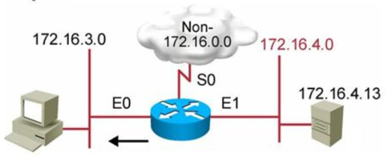
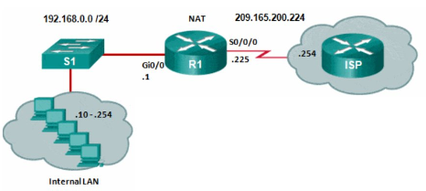

# **Lista de Configuraciones en Equipos de Red Cisco**

[<<< **Volver**](../README_CISCO.md)


|# Item | Tipo de Configuración          |
|------|:-------------------------------:|
| 01  |  [DHCP Server](#dhcp-server)     |
| 02  |  [Named Extended ACL](#named-extended-acl)|
| 03  |  [NAT Estatico](#nat-estatico)    |
| 04  |  [EtherChannel](#etherchannel)    |
| 04  |  [PAgP](#pagp)    |


# _**DHCP Server**_

[<< Volver](#lista-de-configuraciones-en-equipos-de-red-cisco)

Configuracion de un `Servidor DHCP` 

<br>
<div align="center">
    
</div>
<br>

```bash

Router(config)# ip dhcp-pool MYLAN
Router(config-dhcp)# network 192.168.1.0 255.255.255.0
Router(config-dhcp)# default-router 192.168.1.1
Router(config-dhcp)# dns-server 10.10.10.10
Router(config-dhcp)# ip dhcp excluded-address 192.168.1.1

```

# _**Named Extended ACL**_

[<< Volver](#lista-de-configuraciones-en-equipos-de-red-cisco)

Configuracion de un `ACL de Nombre Extendida` 

<br>
<div align="center">
    
</div>
<br>

```bash

Router(config)# ip access-list extended badgroup
Router(config-ext-nacl)# deny tcp 172.16.4.0 0.0.0.255 any eq 23
Router(config-ext-nacl)#  permit ip any any
Router(config-ext-nacl)#  interface e0
Router(config-if)# ip access-group badgruop out

```

# _**NAT Estatico**_

[<< Volver](#lista-de-configuraciones-en-equipos-de-red-cisco)

Configuracion de un `Servicio NAT Estatico` 

<br>
<div align="center">
    
</div>
<br>

```bash

R1(config)# ip nat inside source static 192.168.0.10 209.165.200.225

R1(config)# interface gigabitEthernet 0/0
R1(config-if)# ip address 192.168.0.1 255.255.255.0
R1(config-if)# ip nat inside
R1(config-if)# exit

R1(config)# interface Serial0/0/0
R1(config-if)# ip address 209.165.200.225 255.255.255.224
R1(config-if)# ip nat outside

```

# _**EtherChannel**_

[<< Volver](#lista-de-configuraciones-en-equipos-de-red-cisco)

Configuracion del `EtherChannel`

<br>
<div align="center">
    
</div>
<br>

```bash
switch(config)# interface fastethernet 0/23
switch(config-if)# no switchport
switch(config-if)# channel-group 1 mode on
switch(config)# interface fastethernet 0/24
switch(config-if)# no switchport 
switch(config-if)# channel-group 1 mode on
switch(config)# interface port-channel 1
switch(config-if)# no switchport
switch(config-if)# ip address 10.1.20.1 255.255.255.0
```


# _**PAgP**_

[<< Volver](#lista-de-configuraciones-en-equipos-de-red-cisco)

Configuracion de `PAgP`

<br>
<div align="center">
    
</div>
<br>

```bash
switch_1(config)# interface gi0/0
switch_1(config-if)# no switchport
switch_1(config-if)# channel-group 1 mode auto
switch_1(config)# interface gi0/1
switch_1(config-if)# no switchport 
switch_1(config-if)# channel-group 1 mode auto
switch_1(config)# interface gi0/2
switch_1(config-if)# no switchport
switch_1(config-if)# channel-group 1 mode auto

switch_2(config)# interface gi0/0
switch_2(config-if)# no switchport
switch_2(config-if)# channel-group 1 mode desirable
switch_2(config)# interface gi0/1
switch_2(config-if)# no switchport 
switch_2(config-if)# channel-group 1 mode desirable
switch_2(config)# interface gi0/2
switch_2(config-if)# no switchport
switch_2(config-if)# channel-group 1 mode desirable
```


# _**config4**_


# _**config5**_